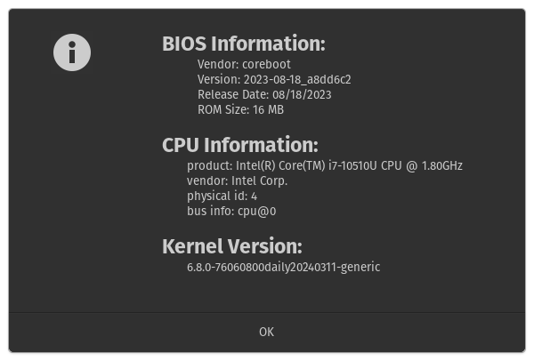

# Framework-System-Details

Go to Activities, search for Framework System Details, launch the application. This will tell you the BIOS version your using, your CPU version (11th or 12th Gen), and of course your kernel version on Ubuntu 22.04.

Running

    sudo python3 bios-checker.py

will show the following window.

